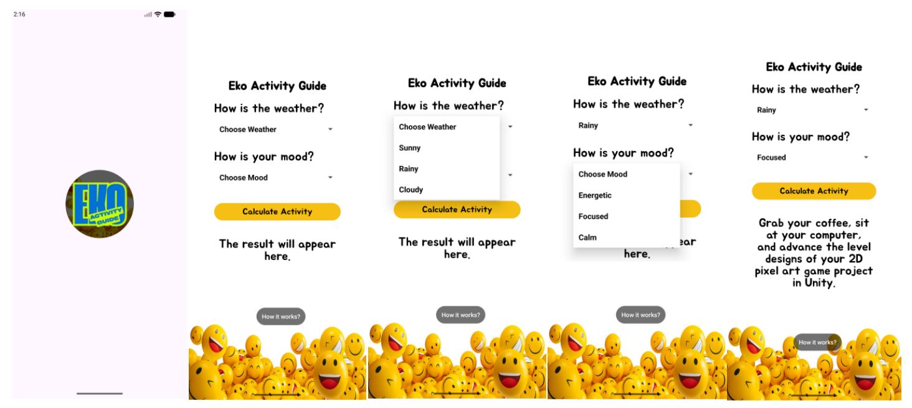
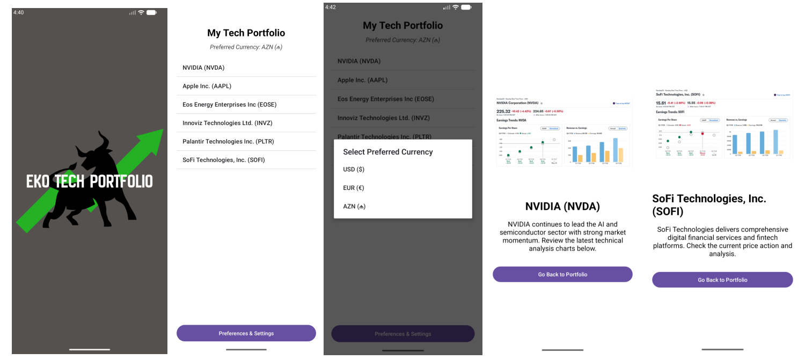

# 📱 Smartphone Apps 2026 - Project Collection

This repository contains two Android applications developed for the final project submission. Both project source folders and installable APK files are included in the root directory

---

## 1️⃣ EKO Activity Calculator
A non-numerical, creative calculator app that suggests personalized activities based on the user's current weather and mood selections. Features a custom splash screen and dynamic UI constraints

---

## 2️⃣ EKO Tech Portfolio
A multi-view financial tracking application that allows users to monitor specific high-growth tech and clean energy assets. It utilizes `SharedPreferences` to persistently store the user's preferred currency

